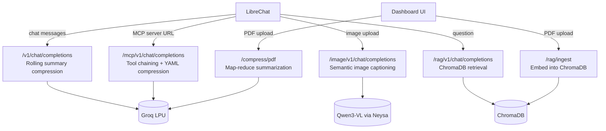

# Context Compression Service

A FastAPI middleware service that sits between [LibreChat](https://github.com/danny-avila/LibreChat) and your LLM provider, transparently compressing bloated context — long chat history, images, MCP tool output, and PDFs — before it ever reaches the model. Built on top of Groq's LPU inference for fast, cheap compression passes.

## Why

LLM context windows are expensive and finite. A lot of what fills them is bloat: repetitive chat history, verbose JSON from tool calls, raw pixels, or entire documents when only a few facts are relevant. This service intercepts that traffic and compresses it — algorithmically where possible, with a cheap LLM pass where necessary — before forwarding it on, so your actual conversation budget is spent on signal, not noise.

## Architecture



Every endpoint speaks the OpenAI `/v1/chat/completions` shape on the outside — regardless of what it actually does internally — so LibreChat can talk to it as a normal custom model endpoint.

## Features

### 💬 Chat text compression
Every request's total token count is checked against a configurable percentage (default 80%) of the model's context limit. When exceeded, older messages are folded into a rolling summary while the most recent messages are kept verbatim. The summary is cached per-conversation (via a fingerprint of the earliest messages) so each subsequent compression only summarizes *new* turns, rather than re-summarizing the whole history from scratch every time.

### 🖼️ Image compression
Uploaded images are resized through an adaptive retry ladder (256px → 192px → 128px) and sent to a vision model (Qwen3-VL) with a structured prompt, returning a dense bullet-point caption organized under **Subject / Setting / Actions / Notable details**. Token metrics compare the vision model's real per-image token cost (via its 32×32 patch tokenization formula) against the caption's token count.

### 🔌 MCP tool JSON compression
Paste a bare MCP server URL (optionally with a plain-English request) and the service will:
- Discover available tools on the server
- Auto-select a tool if only one exists, or use an LLM to pick the right one (and build matching arguments) if there's a request to disambiguate
- Automatically chain multiple dependent tool calls when one tool's output feeds into another (e.g. resolve an ID, then query using it), with duplicate-call detection to avoid infinite loops
- Compress the final raw JSON result into dense YAML via an LLM pass

### 📄 PDF summarization (map-reduce)
A PDF is converted to clean Markdown (via PyMuPDF), split into semantic chunks by header, each chunk is summarized independently (map phase), and all chunk summaries are synthesized into one cohesive executive summary (reduce phase) — with a differential evaluation pipeline available to score how much information was retained versus the original.

### 🧠 RAG knowledge base
PDFs are embedded into a local ChromaDB vector store via the dashboard. Chat questions in LibreChat retrieve the top matching chunks and answer from those directly, rather than loading the whole document into context.

## Project structure

```
context-compression-service/
├── app/
│   ├── main.py                     # FastAPI app entrypoint, router registration
│   ├── core/
│   │   ├── tokenizer.py            # Token counting + chunking utilities
│   │   ├── compressor.py           # Rolling chat summary generation
│   │   ├── mcp_compressor.py       # JSON → YAML compression
│   │   ├── mcp_client.py           # MCP protocol handshake + tool calls
│   │   ├── image_compressor.py     # Vision model captioning
│   │   ├── pdf_compressor.py       # Map-reduce PDF summarization
│   │   └── rag_engine.py           # ChromaDB ingestion + retrieval
│   ├── documents/
│   │   ├── pdf_processor.py        # PDF text extraction
│   │   └── nlp_processor.py        # Local extractive summarization
│   └── routers/
│       ├── openai_proxy.py         # Chat text compression endpoint
│       ├── image_proxy.py          # Image compression endpoint
│       ├── mcp_proxy.py            # MCP compression endpoint
│       ├── rag_proxy.py            # RAG query endpoint
│       └── pdf_proxy.py            # PDF REST upload endpoint
├── frontend/
│   └── index.html                  # Dashboard UI (served at /dashboard)
├── .env                             # API keys (not committed)
└── requirements.txt
```

## Setup

### Prerequisites
- Python 3.10+
- A [Groq API key](https://console.groq.com) (free tier works)
- An MCP-compatible endpoint if you want vision compression (this project uses [Neysa](https://neysa.io) hosting Qwen3-VL, but any OpenAI-compatible vision endpoint can be substituted)
- [LibreChat](https://github.com/danny-avila/LibreChat) running via Docker, if you want the chat integration rather than just the REST API

### Installation

```bash
git clone <your-repo-url>
cd context-compression-service
python -m venv venv
venv\Scripts\activate          # Windows
source venv/bin/activate       # macOS/Linux
pip install -r requirements.txt
```

Create a `.env` file in the project root:

```env
GROQ_API_KEY=your_groq_api_key_here
NEYSA_API_KEY=your_neysa_api_key_here
```

Run the service:

```bash
python -m uvicorn app.main:app --host 0.0.0.0 --port 8000 --reload
```

> **Note:** if your project folder lives inside a cloud-synced directory (OneDrive, Dropbox, iCloud), background sync activity can trigger spurious file-change detection and interrupt in-flight requests when using `--reload`. Move the project to a local-only path, or drop `--reload` and restart manually after edits, if you notice random mid-request interruptions.

Open the dashboard at **http://localhost:8000/dashboard** to test any engine directly without LibreChat.

### LibreChat integration

Add the following to your `librechat.yaml`:

```yaml
version: 1.1.0
cache: true

endpoints:
  custom:
    - name: "Context Compression Engine"
      apiKey: "sk-fake-key-not-needed"
      baseURL: "http://host.docker.internal:8000/v1"
      models:
        default: ["llama-3.1-8b-instant"]
        fetch: false
      titleConvo: true
      titleModel: "current_model"
      dropParams: ["stop", "temperature"]

    - name: "RAG Knowledge Base"
      apiKey: "sk-fake-key-not-needed"
      baseURL: "http://host.docker.internal:8000/rag/v1"
      models:
        default: ["rag-engine"]
        fetch: false
      titleConvo: true
      titleModel: "current_model"
      dropParams: ["stop", "temperature"]

    - name: "Image Compression Engine"
      apiKey: "sk-fake-key-not-needed"
      baseURL: "http://host.docker.internal:8000/image/v1"
      models:
        default: ["image-compressor"]
        fetch: false
      titleConvo: true
      titleModel: "current_model"
      dropParams: ["stop", "temperature"]

    - name: "MCP JSON Compression Engine"
      apiKey: "sk-fake-key-not-needed"
      baseURL: "http://host.docker.internal:8000/mcp/v1"
      models:
        default: ["mcp-compressor"]
        fetch: false
      titleConvo: false
      dropParams: ["stop", "temperature"]

fileConfig:
  clientImageResize:
    enabled: true
    maxWidth: 4000
    maxHeight: 4000
    quality: 0.92

  endpoints:
    "Image Compression Engine":
      fileLimit: 1
      fileSizeLimit: 20
      supportedMimeTypes:
        - "image/.*"
  serverFileSizeLimit: 20
```

Restart LibreChat's backend service (`docker compose restart api`) after any `librechat.yaml` change.

## Usage

| Task | How |
|---|---|
| Compress a long chat conversation | Just chat normally on the **Context Compression Engine** model — compression triggers automatically at 80% of context |
| Compress an image | Switch to **Image Compression Engine**, attach an image, send |
| Compress MCP tool output | Switch to **MCP JSON Compression Engine**, paste a server URL + what you want (e.g. `https://your-mcp-server.com get open issues for project ENG`) |
| Summarize a PDF | Use the dashboard's **Document (PDF) Compressor** tab |
| Ask questions about a PDF | Ingest it via the dashboard's **RAG Knowledge Base** tab, then ask questions on the **RAG Knowledge Base** model in LibreChat |

## API reference

| Endpoint | Method | Purpose |
|---|---|---|
| `/v1/chat/completions` | POST | Chat compression (LibreChat-facing) |
| `/image/v1/chat/completions` | POST | Image compression (LibreChat-facing) |
| `/mcp/v1/chat/completions` | POST | MCP compression (LibreChat-facing) |
| `/rag/v1/chat/completions` | POST | RAG query (LibreChat-facing) |
| `/compress/chat` | POST | Direct chat compression API |
| `/compress/image` | POST | Direct image compression API |
| `/compress/mcp` | POST | Compress a pasted JSON blob |
| `/compress/mcp-external` | POST | Fetch + compress from a live MCP server |
| `/compress/pdf` | POST | Map-reduce PDF summarization |
| `/compress/pdf/local` | POST | Local (non-LLM) extractive PDF summarization |
| `/rag/ingest` | POST | Embed a PDF into ChromaDB |
| `/rag/query` | POST | Query the RAG knowledge base |
| `/evaluate/chat` | POST | Differential quality evaluation (chat) |
| `/evaluate/pdf` | POST | Differential quality evaluation (PDF) |
| `/ws/benchmark` | WebSocket | Streamed CI/CD benchmark run |
| `/dashboard` | GET | Web UI for direct testing |

## Known limitations

- **Session continuity for chat compression** relies on fingerprinting the earliest messages in a conversation, since LibreChat doesn't send a stable conversation ID to custom endpoints. Editing or regenerating early messages can invalidate the cache and trigger a full re-summarization.
- **MCP tool chaining** is capped at a fixed number of steps and relies on an LLM correctly reading JSON schemas to construct arguments — works reliably for simple flat schemas, less so for deeply nested ones.
- **Image token metrics** reflect the image as received by this service, which may already be downscaled by LibreChat's own upload pipeline before reaching it — not necessarily the user's original file resolution.
- **PDF chat integration**: the map-reduce summarizer (`/compress/pdf`) is only reachable via direct API/dashboard use, not through LibreChat's chat interface. For in-chat PDF Q&A, use the RAG ingestion + query flow instead.

## License

MIT
